# REB-parser

Программа для обработки REB файлов.

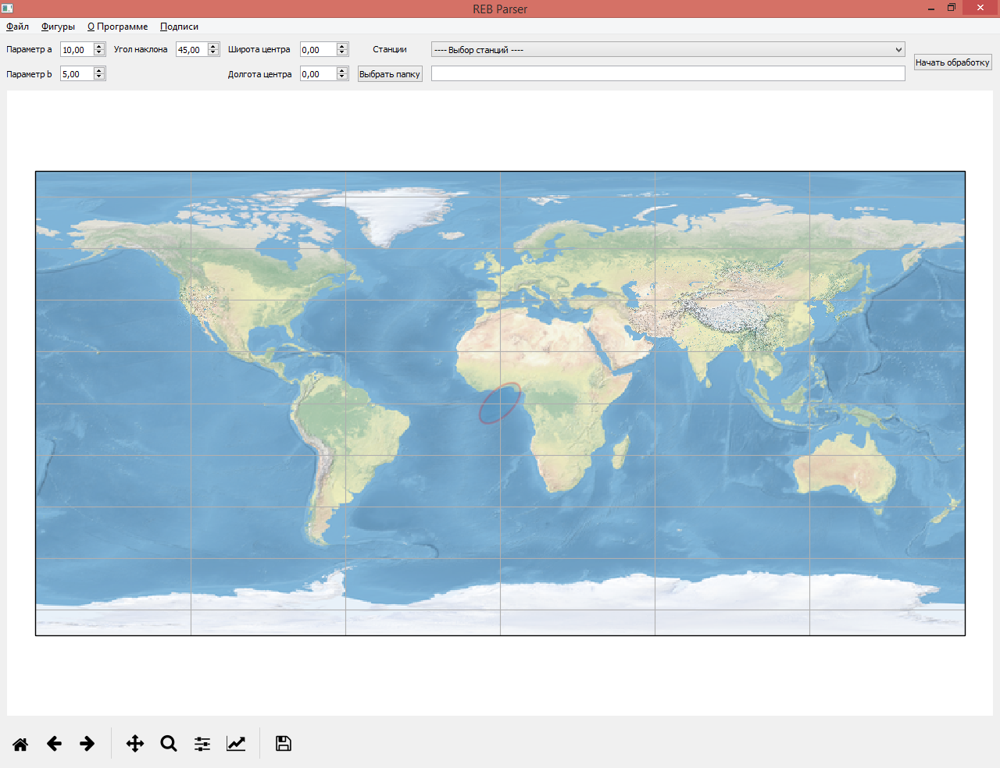

## Описание

Подразумевается, что файлы в формате TXT для обработки разбросаны по папкам. Необходимо задать нужную фигуру, внутри которой будут искаться события, и список станций (будут выбраны только те события, которые были зарегистрированы каждой из станций). В итоге будет создан файл, в который будут скопированы все события, подходящие для данного запроса.

## Запуск проекта

На данный момент реализовано два способа запуска проекта: из EXE-файла и из командной строки интерпретатором Python.

В первом случае исполняемый файл `REB_Parser.exe` должен лежать на одном уровне с папкой `resources`.

Во втором случае запуск производится из папки `src`, лежащей на одном уровне с папкой `resources`, командой:

```text
python main.py
```

При этом на компьютере должен быть установлен Python 3.7+, Qt и все необходимые зависимости.

## Порядок работы

1. Выбрать станции, относительно которых будет производиться поиск:

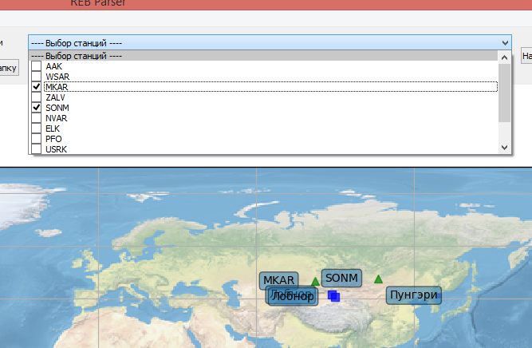

2. Выбрать фигуру, внутри которой будет производиться поиск событий:

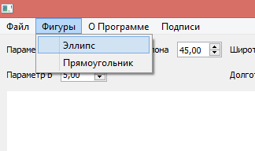

3. Задать параметры этой фигуры (выделено красным). При необходимости можно использовать инструменты для работы с масштабом карты (выделено оранжевым):

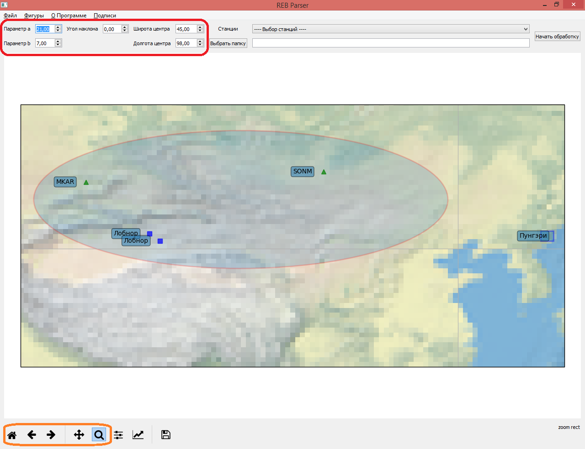

4. Выбрать папку, в которой будет производиться поиск:

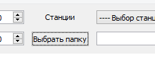

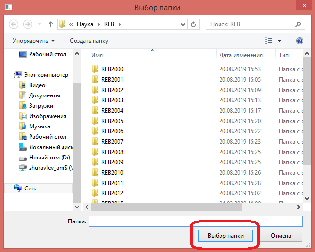

 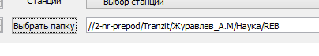

5. Нажать "Начать обработку":

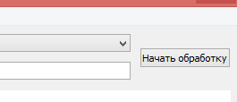

6. Дождаться, пока не будет выведено окно сохранения файла. Выберите место для файла и его имя и нажмите "Сохранить":

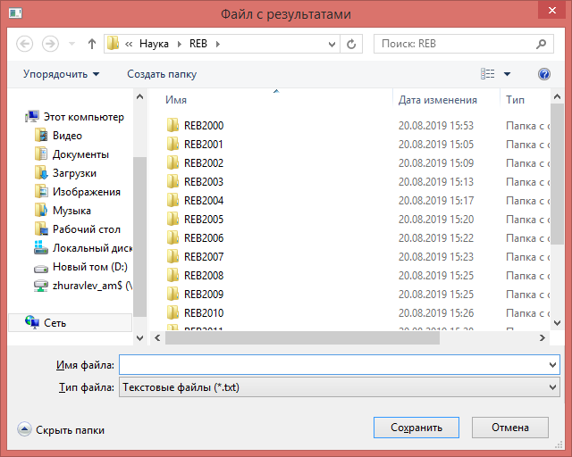

7. На экране появятся все события, которые подходят для выбранного запроса: 

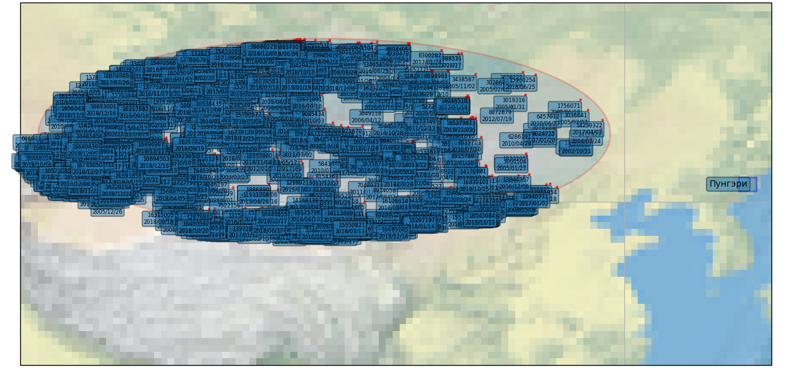

8. При необходимости можно отключить отображение номеров и дат событий:

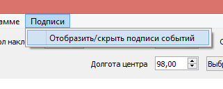

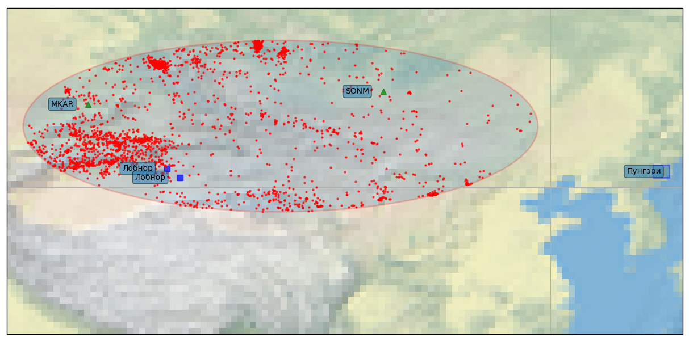

9. При необходимости, можно сохранить текущее состояние карты в файл:

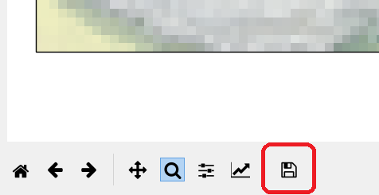

10. Данную инструкцию можно вызвать, нажатием на соответствующий инструмент: 

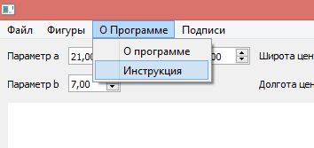

Также, ее можно найти в папке `resources`, под названием `README.pdf`.

## Параметры командной строки

- `-h` или `--help` - Вывести помощь по программе.

- `--light` - запуск программы в "легковесном" режиме, т.е. без подгрузки участков карты вокруг полигонов в высоком разрешении. Например:

```text
REB_Parser.exe --light
```

## Установка

Установить зависимости можно командой:

```text
pip install -r requirements-online.txt
```

## Содержимое папки `resources`

Папка содержит файлы, необходимые для корректной работы проекта:

- Папка `chunks`, в которой лежат высокодетализированные части карты, для повышения производительности.

- Файл `50-natural-earth-1-downsampled.png` - карта Земли низкого разрешения.

- Файл `README.pdf` - данное руководство.

- Файл `stations.json` подробно описывается далее.

## Подгрузка информации о станциях

Информация о станциях подгружается из файла `stations.json`.

Файл состоит из списка структур, описывающих каждую из станций.

### Поля структур `station`

- `name` - название станции;

- `lat` - широта станции (указываются градусы и доли градусов, северная долгота указывается положительными значениями, южная долгота - отрицательными);

- `long` - долгота станции (указываются градусы и доли градусов, восточная долгота указывается положительными значениями, западная - отрицательными);

- `testing areas` - список структур, в каждой из которых находится описание полигонов, мониторинг которых происходит на этой станции. Полигоны бывают двух видов: точечные и в форме прямоугольника.

#### Пример станции

```json
{
    "name": "AAK",
    "lat": 42.64,
    "long": 74.49,
    "testing_areas": [
        ...
    ]
}
```

### Поля точечного полигона

- `type` - `dot`;

- `country` - страна полигона;

- `name` - название полигона;

- `lat` - широта полигона (указываются градусы и доли градусов, северная долгота указывается положительными значениями, южная долгота - отрицательными);

- `long` - долгота полигона (указываются градусы и доли градусов, восточная долгота указывается положительными значениями, западная - отрицательными).

#### Пример точечного полигона

```json
{
    "type": "dot",
    "country": "Китай",
    "name": "Лобнор",
    "lat": 41.54,
    "long": 88.76
}
```

### Поля прямоугольного полигона

- `type` - `square`;

- `country` - страна полигона;

- `name` - название полигона;

- `lat1` - широта первой границы полигона (указываются градусы и доли градусов, северная долгота указывается положительными значениями, южная долгота - отрицательными);

- `lat2` - широта второй границы полигона (указываются градусы и доли градусов, северная долгота указывается положительными значениями, южная долгота - отрицательными);

- `long1` - долгота третьей границы полигона (указываются градусы и доли градусов, восточная долгота указывается положительными значениями, западная - отрицательными);

- `long2` - долгота четвертой границы полигона (указываются градусы и доли градусов, восточная долгота указывается положительными значениями, западная - отрицательными);

#### Пример прямоугольного полигона

```json
{
    "type": "square",
    "country": "Пакистан",
    "name": "Чагай",
    "lat1": 27.95,
    "lat2": 29.95,
    "long1": 64.20,
    "long2": 65.80
}
```

By Zhurik 2020
